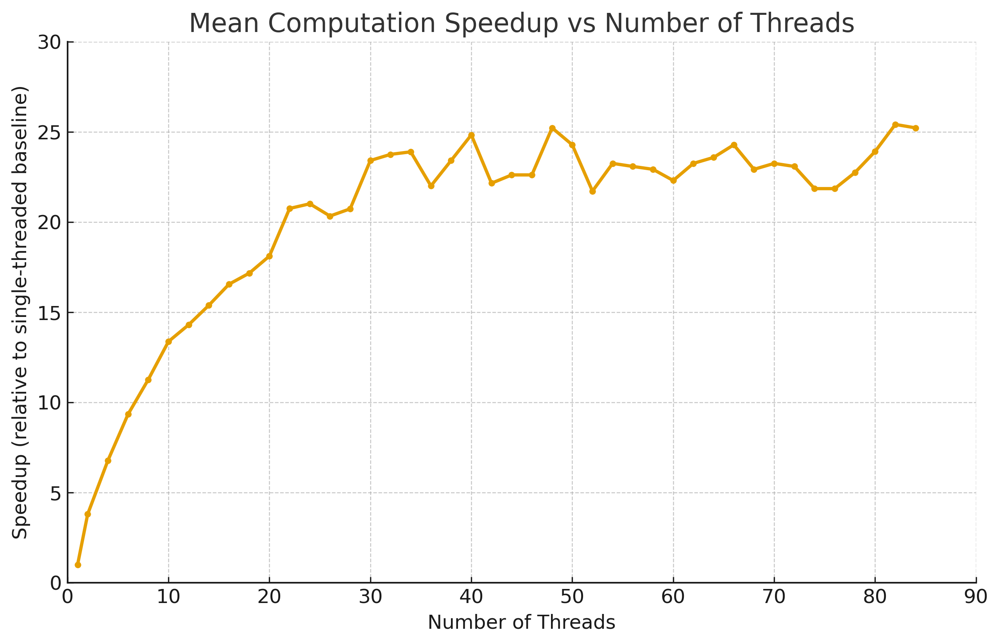
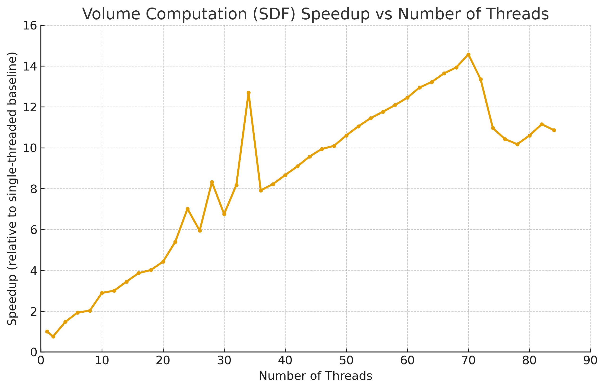
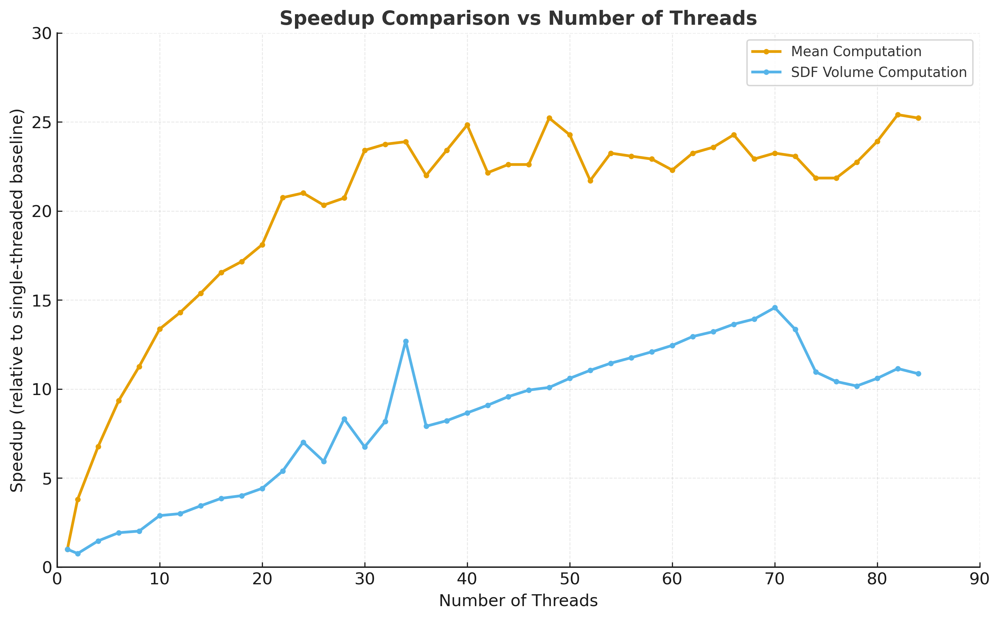

# Project 4: Threading and Multi-core Applications

## Overview

This project focuses on practical applications of multi-threading by converting serial programs to multi-threaded versions. We implemented threaded versions of two applications:
1. **Mean Computation** - Computing the mean of a large dataset
2. **Volume Computation** - Using Monte Carlo integration to estimate volume

---

## "Computing a Mean" Questions

### Question 1: Graph Analysis

**Original Question:** We can determine the speedup we achieve by using threading by computing the following ratio:

$$\text{speedup} = \frac{\text{single-thread running time}}{\text{multi-threaded running time}}$$

Create a graph plotting number of thread along the X-axis and speedup along the Y-axis using your favorite method for creating graphs. For the graph, note the shape of the curve. Does it "converge" to some general value? What's the maximum speedup you got from threading? What happens when you use more cores than are available in the hardware?

**Graph:**

**Response:**

**Shape of the curve:**
The curve increases steadily up until around 20+ threads, at which point it starts to plateau and shows diminishing returns. There are some dips within the 20-25 speedup range, but for the most part it follows a straight arc upward.

**Does it converge to some general value?**
Yes, the speedup curve converges at approximately 23-25x.

**Maximum speedup:**
25.41x at 82 threads

**What happens when you use more cores than are available in the hardware?**
The system has 36 physical cores (72 logical CPUs with hyperthreading). When using more than 36 threads (physical cores), performance improves ever so slightly, reaching maximum speedup at 82 threads (more than both physical and logical cores). However, the improvement is minimal after around 30-40 threads which is around the phsyical core amoun, (curious if that is why it plateaus). While it the system clearly peaked at 82 threads. It has serious deminishing returns compared to the 30ish core mark.

---

### Question 2: Linear Scaling

**Original Question:** Considering the number of cores in the system, do you get a linear scaling of performance as you add more cores?

**Response:**

No, we do not get linear scaling. For the first few extra threads it seems to double performance, but we can quickly see diminishing returns. For example, at 10 threads we get 13x speedup. Linear scaling looks to stop around **16 threads**, where it's speedup is roughly 16x which is the last we see of linearity between the two. Beyond 16+ threads, the speedup begins to dimish. Factors preventing linear scaling include my thread management potentially and the portions of the code that cannot be parallelized.

---

### Question 3: Amdahl's Law Analysis

**Original Question:** In parallel computation, there's a maximum speed up you can achieve that's described by Amdahl's Law. The law considers the time a program takes to run as the sum of the serial part (the part of the code that can't or isn't parallelized, like reading files), and the parallelized part, which can mathematically be written as

$$T = (1- p)T + pT$$

where p is the percentage of the program that is parallelized. When the parallel parts of the program are run using n threads, the timing becomes

$$T = (1 - p)T + \frac{p}{n}T$$

If you used an infinite number of processors, the $\frac{p}{n}T$ would approach zero, as the runtime is dominated by the serial part. You can see this on the graph, as adding more threads doesn't continue to decrease the runtime. Looking at your graph, what value would you proposed for p, and describe how you arrived at that value.

**Response:**

**Proposed value for p (parallelized percentage):**
Using Amdahl's Law and isolating p, we get: p = 1 - 1/max_speedup

With our maximum speedup of 25.41x: p = 1 - 1/25.41 ≈ 0.96 = **96%**

**How I arrived at this value:**
This means that approximately 96% of the program is parallelizable and 4% was not. This means with infinite threads we could only reach that theoretical limit of ~25x speedup. I don't think we can reach 100% parallel due to file reading having to happen sequentially, among other things like thread setup, and the final sums. 

---

### Question 4: Bandwidth Analysis

**Original Question:** Finally, consider the kernel of the mean computation. How many bytes of data are required per iteration? What's the associated bandwidth used by the kernel? Is that value consistent when you consider threaded versions?

**Response:**

**Bytes of data required per iteration:**
Each iteration reads one float value, which is 4 bytes.

**Bandwidth calculation:**
We are handling 8.5 billion floats, each of which is 4 bytes, giving us 34 GB total of data. For bandwidth we calculate data/time. 

- **Single-threaded:** 34 GB / 32.78s = **1.04 GB/s**
- **4 threads:** 34 GB / 4.84s = **7.02 GB/s**
- **16 threads:** 34 GB / 1.98s = **17.17 GB/s**
- **82 threads (maximum):** 34 GB / 1.29s = **26.36 GB/s**

**Is bandwidth consistent across threaded versions?**
No, bandwidth is not consistent - it increases with the number of threads. Each thread processes its chunk of data in parallel, so total bandwidth scales with thread count. The bandwidth increases from 1.04 GB/s (single-threaded) to 26.36 GB/s (82 threads), showing that more threads allow for higher total data throughput. Again with dminishing returns.

---

## "Computing a Volume" Questions

### Question 1: Performance Curve Comparison

**Original Question:** After you've completed sdf.cpp, update the trails.sh file by commenting the line that executes mean.out and threaded.out, and uncomment the lines that execute your sdf.out (as compared to the mean computation exercise, we don't have a serial version of sdf.cpp; just execute it using a single thread, using the -t option). Again collect the runtimes, and compute the speedups, and graph the results.

**To Do: Do you get similar performance curve to threaded.out?**

**Graphs:**

**Response:**

**Do you get similar performance curve to threaded.out?**
No, the performance curves are different. I get two separated performance curves for both graphs. The SDF curve, ignoring the irregularity at 34 cores, seems to go in a straight line, while the mean computation started off more parabolic. 

One notable difference is that after 70 threads, the SDF performance actually goes down. This is because the system has 72 logical CPUs, and once you exceed the number of available CPU cores, you get context switching overhead and cache overload which negatively impacts perfomance

**Key observations:**
- Maximum speedup for sdf: 14.57x at 70 threads
- Maximum speedup for mean: 25.41x at 82 threads
- Mean computation has a higher speedup vs SDF

**Why they differ:**
SDF is slower as it has to do more computation. Mean computation is sequential read an input and add it from a file. The data is already there in the file, so it's just simple addition operations that are easy to parallelize. While SDF has to generate random numbers first, then do more complex math like distance calculations and vector operations. Each thread needs its own random number generator, which adds more computation per thread... When going past the physical amount of threads we actually get negative results to speed. 

---

## Summary

### Mean Computation Results
- **Baseline time:** 32.78 seconds (single-threaded)
- **Best threaded time:** 1.29 seconds at 82 threads
- **Maximum speedup:** 25.41x
- **Data processed:** 8,500,000,000 float values
- **Computed mean:** 52.7182 (expected: 52.7128)

### Volume Computation Results
- **Baseline time:** 12.82 seconds (single-threaded)
- **Best threaded time:** 0.88 seconds at 70 threads
- **Maximum speedup:** 14.57x
- **Samples:** 1,000,000,000 points
- **Computed volume:** ~0.476 (expected: 0.4764012244)

---

## Files

- `mean.cpp` - Serial mean computation program
- `threaded.cpp` - Multi-threaded mean computation program
- `sdf.cpp` - Multi-threaded volume computation program
- `trials.sh` - Script for automated timing trials
- `all-timing-data.txt` - Complete timing data for both programs

---

## Disclaimer

AI assistance was used to format and structure this README document. All analysis, data interpretation, graph creation, and conclusions are my own work.

