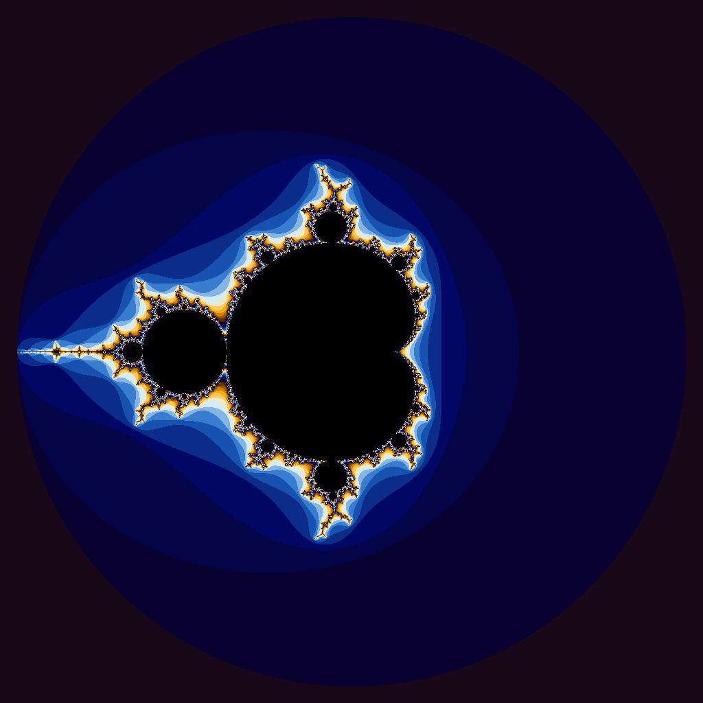

# Project 6 — CUDA Applications

This project implements two CUDA applications to demonstrate GPU acceleration capabilities and limitations.

## Program Descriptions

### 1. CUDA-accelerated iota function

This program fills an array with sequential numbers (like 0, 1, 2, 3...). I created two versions:

- **iota.cpp / iota.cpu**: Runs on the CPU using a simple loop. It goes through the array one element at a time and sets each value.

- **iota.cu / iota.gpu**: Runs on the GPU using CUDA. Instead of doing one element at a time, it uses many threads in parallel to fill multiple array positions at once. Each thread figures out which array position it should fill and does the work simultaneously with all the other threads.

### 2. CUDA-accelerated Julia Set Generator

This program generates a fractal image called a Julia set (or Mandelbrot set). I created two versions:

- **julia.cpp / julia.cpu**: Runs on the CPU and processes the image pixel by pixel. For each pixel, it does math to figure out what color it should be, then moves to the next pixel.

- **julia.cu / julia.gpu**: Runs on the GPU and processes all the pixels at the same time. Since each pixel's calculation is independent (one pixel doesn't need to wait for another), the GPU can use its thousands of cores to work on many pixels simultaneously.

## Performance Analysis: iota Function

**Question:** Are the results what you expected? Speculate as to why it looks like CUDA isn't a great solution for this problem.

**Answer:**

I was actually surprised the CPU version ended up being faster! At 1 billion elements, the CPU finished in **5.39 seconds** while the GPU took **6.67 seconds**. When I think GPU, I tend to thing they are used for gaming and good at rendering frames so i'd have anticipated it to be way better than a CPU.

**REasons why?** 

1. The startup may be costlier. Before the GPU can do any work, you have to copy all the data from the computer's memory to the GPU's memory, launch the kernel, and then copy everything back. For a simple task like filling an array, this overhead takes longer than the actual work itself. 

2. Perhaps the workload is to simple.

4. **Overhead never goes away**: Even with huge arrays (billions of elements), the overhead of transferring data and starting up the GPU is still too much compared to the CPU's rightaway starting.

Basically, GPUs are awesome for problems that need lots of heavy computation that can be done in parallel (like the Julia set, where each pixel needs hundreds of complex math operations). But for simple tasks like filling an array with numbers, the CPU's simpler, direct approach wins.

## Generated Image

